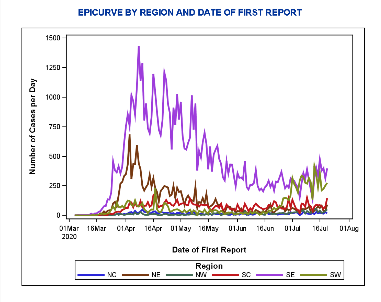

# Critique By Design 

## Original Data Visualization

Source: [PA Health](https://www.health.pa.gov/topics/disease/coronavirus/Pages/Cases.aspx)

With the second spike of COVID-19 cases sweeping the nation, I wanted to research PA cases. 
I found this visualization which explains the cases reported by day for each region. 
I believe the information on the current graph is valuable, but there was a lot of room for improvement. 

Using Stephen Few's Data Visualization Effectiveness critique method, I saw that the current format of the visualization was not complete. 
The regions are not specified and a cumulative case amount was not displayed. Also, the data of regions with low numbers was not easily readable. 

## The Process of Design 
First, I sketched a redesign on paper and submitted it to three individuals for feedback. 

I chose a stacked bar graph to capture not only individual region case numbers but also state wide cumulative amounts. 
I also created a color-code map of the regions, vice just a color legend. 
The audience might not be familiar PA regions nor be able to visualize each region mentally. 

During my sketch, I knew I would have to case my x-axis wisely, and my color scheme appropriately to fit both the graph and the map. 
The feedback I received but that the bars in the graph were not easily differentiable, this level to me stacking them differently. 
One individual also pointed out that there were only months on the x-axis and not days, which led to me keep some date milestones and not just months. 

## Final Product

<noscript>
</noscript><object class='tableauViz'  style='display:none;'><param name='host_url' value='https%3A%2F%2Fpublic.tableau.com%2F' /> 
<param name='embed_code_version' value='3' /> <param name='site_root' value='' /><param name='name' value='PACOVID&#47;Dashboard' /> <param name='tabs' value='no' /><param name='toolbar' value='yes' />
<param name='static_image' value='https:&#47;&#47;public.tableau.com&#47;static&#47;images&#47;PA&#47;PACOVID&#47;Dashboard&#47;1.png' />
<param name='animate_transition' value='yes' /> <param name='display_static_image' value='yes' /> <param name='display_spinner' value='yes' /> <param name='display_overlay' value='yes' />
<param name='display_count' value='yes' /> <param name='language' value='en' /> <param name='filter' value='publish=yes' /></object>
 

During the build process, I reviewed color choices and thought a very deep red to pale blue sequential scale would make the most sense. 
It allowed for quick insight on areas with the most cases. I used coolors.co to create my own palette. 
Creating the colored map was a good learning experience for me with the use of Tableau! I learned alot more about the possibilites and navigation of the software. 
