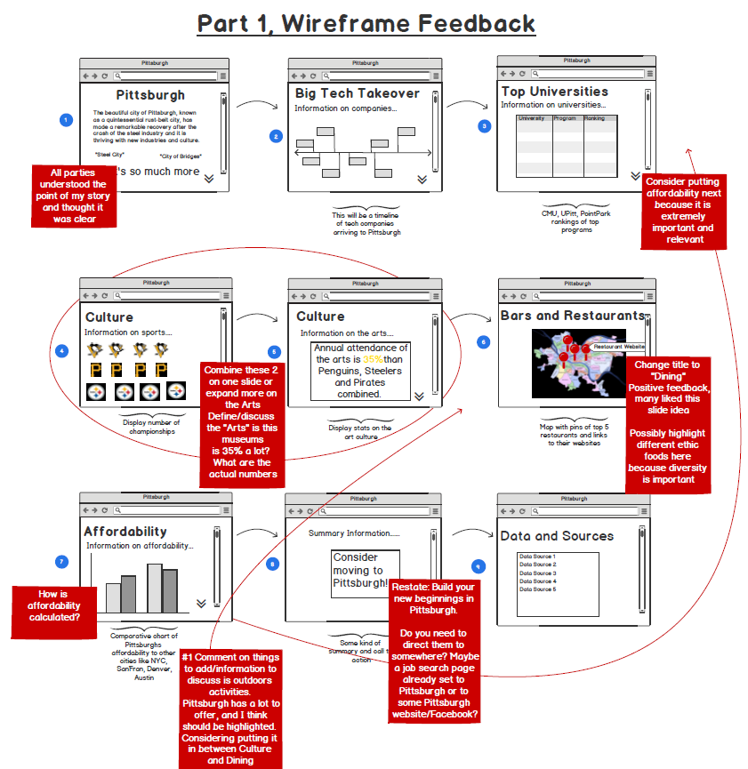

# Final Project, Part 1

## Purpose:
I moved to Pittsburgh 3 years ago and have fallen in love with the city. Pittsburgh, known as a quintessential rust-belt city, has made a remarkable recovery after the crash of the steel industry and it is thriving with new industries and culture. I do not think this is common knowledge to individuals who have not visited or lived here. 

## Target of Story:
My targeted audience is successful individuals and students who would originally flock to the Bay Area, NYC, Austin, Denver, etc. As a reader, I would want to learn more about Pittsburgh so I can consider relocation opportunities. 

I want to address the topics of tech industries, universities, culture, restaurants, and affordability in my design. Questions I aim to address are: 
  - What tech industries are in Pittsburgh?
  - What good university programs are in Pittsburgh?
  -	What is the culture like in Pittsburgh?
  - What is a restaurant and bar scene like?
  - How affordable is it to live there?

## StoryArc Sketch:
This is my StoryArc: the feelings I want me reader to experience during their viewing. 

  
## Wireframe: 

   
## Presentation Method: 
I will be constructing my visualizations using Tableau and Infogram. As of now, I believe I will have 5 visualizations to construct. Some are simple and some more involved. Information on the types of visualizations I plan on using are above in the wireframe and below in the Data section. For my presentation, I will be constructing a project in Shorthand. Shorthand has imagery and scrolling features that I will incorporate.

## Data:
<ins>Industry Data:</ins> I will be using dates from company entries into Pittsburgh and create a timeline of their arrival. Data was scraped from this [report](https://www.innovationworks.org/wp-content/uploads/2018/03/IW-EY-report-2008-to-2017.pdf) and put into an [Excel](/TechCompany.xlsx) file.

<ins>University Data:</ins> I will be using information scraped from [QS University Subject Rankings](https://www.topuniversities.com/subject-rankings/2020) on top-rated programs in Pittsburgh at different universities and I will be formulating a table. 

<ins>Sports Data:</ins> I have compiled a list of national championships, from Google's [database](https://www.google.com/search?q=pittsburgh+steelers+super+bowl+wins&rlz=1C1EJFC_enUS874US874&oq=pittsburgh+steelers+superbowl&aqs=chrome.1.69i57j0l7.25403j1j9&sourceid=chrome&ie=UTF-8) and manipulated turned it into an [Excel](/SportsData.xlsx) file.  I will be displaying them by the organization and I plan on using their logos as a way to visualize each team.

<ins>Art Data:</ins> I found some interesting statistics from [Pittsburgh Art Council](websitehttps://www.pittsburghartscouncil.org/advocacy/take-action/facts-and-figures) and will be highlighting it in text.

<ins>Restaurant Data:</ins> I will be using geolocation data from [OpenData](http://pghgis-pittsburghpa.opendata.arcgis.com/datasets/3ca13246362540fa8b4b567f84a1255b_0?uiTab=table>) to create a map, and then I will be scraping Yelp for data on 5 different restaurants in Pittsburgh I want to highlight. I haven’t decided which restaurants I want to highlight, but I think it will be one from each popular neighborhood: Mt. Washington, Lawrenceville, Downtown, Shadyside, and Squirrel Hill.

<ins>Affordability Data:</ins> I found this dataset on [Numbeo](https://www.numbeo.com/cost-of-living/) and transformed it to an [Excel](/Affordablity.csv). I plan on using a bar chart to highlight Pittsburgh’s ranking, and then point out other high-tech cities such as San Fran, Denver, Austin, NYC. 
  
  
## User Research Protocol and Interviews and Feedback:
**A. Target Audience:** My story is targeting a specific audience, individuals looking to relocate for work or school. I am aiming to teach them about what Pittsburgh has to offer and why they could reconsider it, compared to other big cities. This with the purpose to increase the Pittsburgh economy and keep the city on an upward swing. 

**B. Identifying Interviewees:** I have chosen four individuals for feedback on my story. I have decided these because they are all from different backgrounds and have different exposures to Pittsburgh. 

    A. Mid 20s CMU graduate student who is contemplating future employment locations
    B. Mid 30s highly educated experience in data and design with little Pittsburgh experience
    C. Mid 20s tech industry worker looking to go back to school or leave the Bay area in hopes of another job
    D. Mid 30s Pittsburgh native with a deep-seated love of the city

**C. Interview Script and Questions:**
I will be providing the following information to my interviewees in hopes of identifying any information that is unclear, any ideas that could be improved and to gauge whether or not I am telling my story effectively. I will be conducting this interview by emailing them my wireframe and having them answer questions via phone call. 
I am friends or family to all the interviewees, so I will briefly describe the purpose of the project and discuss the use of a wireframe. I will then ask the following questions after they take 1-2 minutes to review the wireframe: 

  1. It is clear what story I am trying to tell? 
  2. What is unclear or confusing?
  3. What stands out and is very memorable?
  4. What other information would you like to see?
  5. What do you think my “call to action” is?
  6. Would this compel you to consider living in Pittsburgh?

**D. Feedback:**
 I have incorporated my feedback into the wireframe below
 

## Final Project Expected Challenges:
In part 2 of the project, I will be incorporating my feedback into my design as well as finishing my visualizations and building the Shorthand presentation. I expect my biggest challenge to be in building a section on outdoor activities as well as adjusting the way I present the arts. I expect the map of restaurants to be the hardest visualization to implement. I will also be getting familiar with Shorthand for the first time. I believe I have done enough research and preparation to finish my project by the due date, August 5th. 

[Back to Portfolio Page](/README.md)
